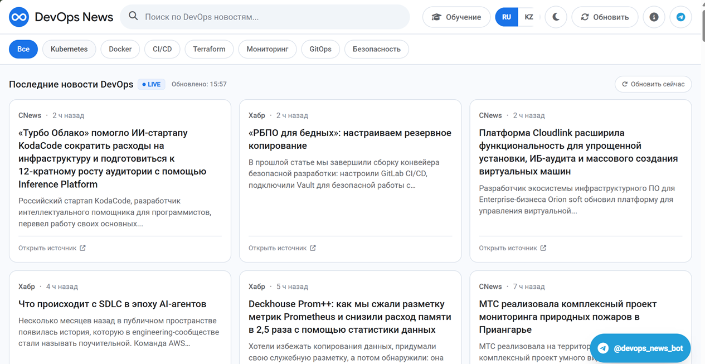

# DevOps News — отказоустойчивый деплой на Docker Swarm

Живой новостной сайт о DevOps (Docker, Kubernetes, CI/CD, Terraform, GitOps, SRE), развёрнутый как кластерное приложение: 3 реплики, общее хранилище данных, автоматическое восстановление после сбоя контейнера или целого узла.

Проект демонстрирует полный DevOps-цикл: от настройки Linux-серверов и SSH-доступа до автоматизированного деплоя в Docker Swarm через Ansible.



## Что внутри

- 🐳 **Docker** — кастомный образ на `node:20-alpine`, приложение на Express
- 🐝 **Docker Swarm** — 3 реплики сервиса, overlay-сеть, политика перезапуска при сбое
- 🤖 **Ansible** — один плейбук полностью поднимает кластер: Docker, NFS, Swarm init/join, деплой стека
- 📡 **NFS shared storage** — общая папка с данными (`articles.json`, `admin-users.json`) видна всем репликам одинаково
- 🔐 **SSH key-based доступ** — отдельный ключ, пользователь `devops` с sudo без пароля
- ♻️ **Отказоустойчивость** — проверено вживую: убийство контейнера и полное падение узла, сервис не теряет доступность

## Архитектура

```
                    ┌─────────────────────┐
                    │  Ansible Control     │
                    │  192.168.10.13       │
                    └──────────┬───────────┘
                               │ SSH (ключ)
        ┌──────────────────────┼──────────────────────┐
        │                      │                      │
┌───────▼────────┐    ┌────────▼────────┐    ┌────────▼────────┐
│ Swarm Manager   │    │ Worker 1        │    │ Worker 2        │
│ 192.168.10.21   │◄──►│ 192.168.10.22   │◄──►│ 192.168.10.23   │
│ + NFS server    │    │ + NFS client    │    │ + NFS client    │
└────────┬────────┘    └────────┬────────┘    └────────┬────────┘
         │                      │                       │
         └──────────── overlay network (webnet) ─────────┘
                  3 реплики devops-news:latest
                  порт 80 доступен с любой ноды
```

## Структура репозитория

```
app/                  # исходный код сайта (Express + EJS)
docker/Dockerfile      # сборка образа приложения
ansible/
  ├── playbook.yml     # установка Docker, NFS, Swarm, деплой
  ├── inventory.ini     # описание узлов кластера
  └── ansible.cfg
stack.yml              # манифест для `docker stack deploy`
```

## Как развёрнуто

1. **Linux**: 4 Ubuntu-сервера (1 control node + 1 manager + 2 worker), SSH по ключу, пользователь `devops`, открыты порты 80/2377/7946/4789.
2. **Git**: код и манифесты лежат в этом репозитории, секреты (`.env`) — отдельно, вне git.
3. **Docker**: образ собирается локально на каждой Swarm-ноде из `docker/Dockerfile`.
4. **Docker Swarm**: `docker swarm init` на manager → воркеры присоединяются по токену → `docker stack deploy -c stack.yml news`.
5. **Ansible**: весь пункты 3–4 одной командой:
   ```bash
   ansible-playbook -i ansible/inventory.ini ansible/playbook.yml
   ```

## Проверка отказоустойчивости

```bash
# Убить контейнер вручную — Swarm пересоздаст его за секунды
docker kill <container_id>

# "Уронить" целый узел — реплика переедет на другую ноду
sudo shutdown -h now   # на одном из worker
```

В обоих случаях сервис остаётся доступным на `*:80` с любой живой ноды без ручного вмешательства.
